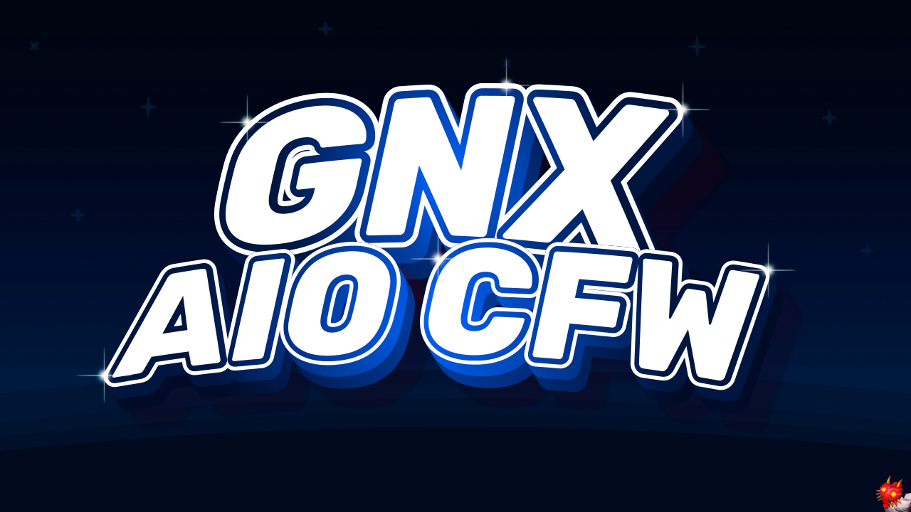

<h1 align="center">GNX: Nintendo Switch AIO CFW</h1>

For details about how to properly setup GNX, check [English Guide](English.md).

O GNX nasceu da ideia de simplificar a vida que quem tem um Nintendo Switch modificado. Como você mesmo pode notar pelo README, a cena do switch é extremamente fragmentada e composta por vários **Devs** diferentes que possuem seus respectivos projetos, com isso, fica meio inviável para um iniciante saber oque baixar e como configurar tudo. Por isso o [Goma1337](https://twitter.com/goma1337) criou um pacote AIO (All in One) com tudo que você precisa para usar no seu Switch.

## ► **[FAÇA O DOWNLOAD POR AQUI!](https://github.com/vncsmnl/GNX/releases)** ◄

## **🚦 BOOTLOADER:**

- [Hekate](https://github.com/CTCaer/hekate/releases): Payload utilizada pelo GNX. Serve para "organizar" o desbloqueio e possui diversas funcionalidades úteis como formatação de SD, criação de EmuNAND, toggle de AutoRCM, etc.

## **🌌 CFW:**

- [Atmosphère](https://github.com/Atmosphere-NX/Atmosphere/releases): A custom firmware em si, que possibilita o uso de todos os recursos inclusos no pacote.

## **🧩 HOMEBREWS:**

- [aio-switch-updater](https://github.com/HamletDuFromage/aio-switch-updater/releases): Software que atualiza diversos arquivos úteis para um switch desbloqueado. Por padrão, ele vem no pacote com vários recursos desativados, a fim de evitar que usuários mais leigos desconfigurem o GNX e acabem, entre outras coisas, banidos. Se voce não sabe o que está fazendo, use esse homebrew apenas para baixar cheats.

- [Battery_Desync_Fixer_NX](https://github.com/CTCaer/battery_desync_fix_nx/releases): Este homebrew serve para recalibrar a bateria do console, caso ela esteja descalibrada. Siga atentamente as instruções em [aqui](https://github.com/CTCaer/battery_desync_fix_nx) se for utilizá-lo.

- [CNX-updater](https://github.com/AMSNX/cnxpack-updater): Este homebrew, desenvolvido pelo Marcus Miranda e o Ricardo "CostelaBR", é capaz, entre outras coisas, de baixar traduções/mods.

- [DBI](https://github.com/rashevskyv/dbi/blob/main/README_ENG.md): Poderosa ferramenta multiuso. Serve como administrador de arquivos, instalador de .nsp e .nsz, entre outras coisas. Visite o github do projeto para mais informações.

- [EdiZon](https://github.com/WerWolv/EdiZon/releases): Ferramenta para uso de cheats. Funciona também pelo Tesla Menu (L + Baixo no Dpad + R3).

- [Goldleaf](https://github.com/XorTroll/Goldleaf/releases): Ferramenta multiuso para instalar jogos, acessar o browser pelo console, editar avatares e outras coisas mais.

- [Hekate Toolbox](https://github.com/WerWolv/Hekate-Toolbox/releases): Ferramenta para habilitar / desabilitar módulos de sistema e integrar algumas funcionalidades do Hekate dentro do Horizon (sistema operacional do Switch).

- [Homebrew App Store](https://www.switchbru.com/appstore/): Uma "loja de homebrews" mantida pela comunidade. Por ela você pode baixar outros softwares que não são inclusos no pacote.

- [Homebrew Menu](https://github.com/switchbrew/nx-hbmenu/releases): O menu que substitui o álbum e / ou jogos (se você os abrir segurando R) e possibilita o uso de homebrews.

- [ldnmitm_config](https://github.com/spacemeowx2/ldn_mitm/releases): Homebrew para configuração do módulo ldn_mitm.

- [Linkalho](https://github.com/rdmrocha/linkalho): Homebrew para vincular e desvincular contas Nintendo. O vínculo é falso e serve apenas para enganar jogos que têm esse requerimento.

- [Lockpick_RCM](https://github.com/shchmue/Lockpick_RCM/releases): Payload para dumpar as keys do seu console (diversos softwares precisam das keys para funcionar, com oo NxNandManager).

- [NX-Activity-Log](https://github.com/tallbl0nde/NX-Activity-Log): Homebrew que monitora de maneira detalhada o tempo de uso de cada jogo.

- [NXThemesInstaller](https://github.com/exelix11/SwitchThemeInjector/releases): Instalador de temas. Sempre utilize essa ferramenta para remover seus temas ANTES de atualizar a firmware do console.

- [prodinfo_gen](https://github.com/CaramelDunes/prodinfo_gen/releases/): Payload capaz de gerar uma prodinfo falsa, útil para salvar consoles com a prodinfo brickada. A prodinfo gerada pelo console NÃO serve para jogar online, agindo apenas como um "incognito" mais sofisticado. O usuário comum não precisa mexer com isso.

- [Reset Parental Controls](https://github.com/ITotalJustice/Reset-Parental-Controls-NX/releases): Software capaz de remover os controles parentais mesmo sem a senha.

- [TegraExplorer](https://github.com/suchmememanyskill/TegraExplorer/releases): Payload com uma série de funcionalidades. Está no pacote primariamente para possibilitar o uso do script...
  - SyncFix.te, localizado na pasta TegraExplorer. Ele serve para sincronizar os controles e conexões da SysNAND para a EmuNAND, evitando assim a necessidade de ressincronizar os controles cada vez que alternar entre as NANDs.

- [Tinfoil](https://tinfoil.io/Download#download): um dos mais completos instaladores da cena, com funcionalidades de rede e outras funções de sistema.

## **💡 MÓDULOS DE SISTEMA PARA O ATMOSPHERE**

Podem ser habilitados ou desabilitados pelo homebrew Hekate Toolbox ou pelo Tesla Menu (L + D-pad para Baixo + R3):

- [Emuiibo](https://github.com/XorTroll/emuiibo/releases): Módulo capaz de emular amiibos. Os amiibos já são inclusos no pacote, mas podem ser gerados no pelo Emutool, também incluso. Depois de habilitado o módulo, escolha o amiibo pelo Tesla Menu (L + D-pad para Baixo + R3).

- [Fizeau](https://github.com/averne/Fizeau/releases): Módulo que permite ajustes de cores à imagem do Switch.

- [ldn_mitm](https://github.com/spacemeowx2/ldn_mitm/releases): Transforma a funcionalidade de local multiplayer em Lan, possibilitando assim o uso do Lan Play em jogos que não têm a funcionalidade de Lan nativamente.

- [MasterVolume](https://github.com/averne/MasterVolume/releases): Potencialize ou ajuste o volume diretamente pelo controle do Switch mesmo quando conectado na Dock.

- [Mission Control](https://github.com/ndeadly/MissionControl/releases): Possibilita o uso de controles bluetooth de outras plataformas no Switch. Para usar, habilite o módulo, reinicie o console e sincronize o controle pelo menu do Switch, como faria com um controle da Nintendo. Para mais detalhes de como sincronizar cada controle, visite o Github.

- [nx-ovlloader](https://github.com/WerWolv/nx-ovlloader/releases): Componente necessário para o funcionamento do Tesla Menu.

- [ovlSysmodules](https://github.com/WerWolv/ovl-sysmodules/releases): Componente do Tesla Menu que exibe os toggles de módulo de sistema.

- [Reboot](https://github.com/dezem/Safe_Reboot): Reinicie seu Nintendo Switch rapidamente (ideal para consoles modchip).

- [SaltyNX](https://github.com/masagrator/SaltyNX/releases): Framework para possibilitar alguns truques de performance como o...
  - [ReverseNX-RT](https://github.com/masagrator/ReverseNX-RT/releases), que "engana" o console, forçando-o a pensar que está dockado no modo portátil e vice-versa.

- [Status Monitor Overlay](https://github.com/masagrator/Status-Monitor-Overlay/releases): Componente do Tesla Menu que exibe informações em tempo real como temperatura, porcentagem de uso dos recursos do sistema, etc.

- [sys-clk](https://github.com/retronx-team/sys-clk/releases): Serve para realizar overclock no console e pode ser configurado pelo Tesla Menu (L + D-pad para Baixo + R3) graças ao...
  - [sys-clk-Overlay](https://github.com/Sun-Research-University/sys-clk-Overlay/releases)

- [sys-con](https://github.com/cathery/sys-con/releases): Possibilita o uso de controles de outras plataformas no Switch contanto que estejam conectados por cabo. Apesar dessa desvantagem em relação ao Mission Control, possui compatibilidade com mais controles.

- [SysDVR](https://github.com/exelix11/SysDVR/releases): Realiza streaming de áudio e vídeo do console para um PC, funcionando tanto por rede local como por cabo USB. Para maiores detalhes de como usar, visite o wiki do projeto [aqui](https://github.com/exelix11/SysDVR/wiki)

- [sys-ftpd-light](https://github.com/cathery/sys-ftpd-light/releases): Transforma o Switch num servidor de FTP, possibilitando a transferência de arquivos por rede local com o auxílio de uma ferramenta como o Filezilla.

- [sys-screenuploader](https://github.com/bakatrouble/sys-screenuploader/releases): Faz upload de screenshots e capturas de vídeo para o Discord ou Telegram. Por padrão, vem configurado para subir as capturas para o #sys-screenuploader do servidor de [Discord GNX](http://tiny.cc/DiscordGNX). Isso pode ser modificado [aqui](https://screenuploader.bakatrouble.me/)

- [sys-tune](https://github.com/HookedBehemoth/sys-tune/releases): Player de música em plano de fundo, acessível pelo Tesla Menu.

- [Tesla Menu](https://github.com/WerWolv/Tesla-Menu/releases): Menu que pode ser aberto a qualquer momento com a combinação de botões L + D-pad para Baixo + R3. Serve para configurar módulos, exibir informações e várias outras coisas.

## **🖥️ SOFTWARES PARA USO NO PC:**

- [GUIformat](http://www.ridgecrop.demon.co.uk/index.htm?guiformat.htm): Ferramenta para formatar o cartão SD em Fat32 (recomendado). Não funciona se alguma janela do Windows Explorer estiver aberta.

- [TegraRcmGUI Portable e Installer](https://github.com/eliboa/TegraRcmGUI/releases): Injetor de payload.

## 🤝 Colaboradores

Agradecimentos especiais para as seguintes pessoas que contribuíram para este projeto:

- [SciresM](https://twitter.com/SciresM) pelo Atmosphere.
- [CTCaer](https://twitter.com/CTCaer) pelo Hekate e Nyx.
- [goma1337](https://twitter.com/goma1337) pela integração de tudo.
- [JuniorPassos](https://github.com/JuniorPassos) pelos complementos e módulos PT-BR testados e aprovados.

## 📝 Licença

The Nintendo Switch names and logos are a trademark of [Nintendo](https://github.com/Nintendo). This repository is in no way affiliated with [Nintendo](https://github.com/Nintendo) or any of its partners.

<a href="#top">🔝 Volte para o topo</a>

